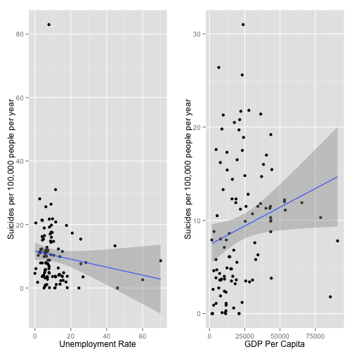
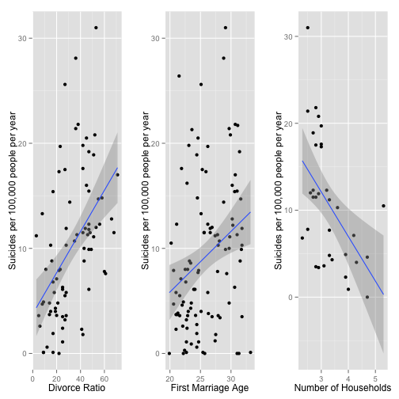
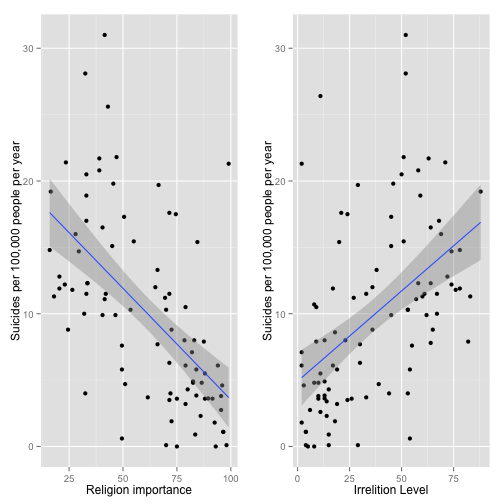

Correlation of Suicide rates against Economical, Social, and Spiritual Factors
========================================================
author: Omar Gomez 
date: 

Correlation of Suicide rates against Economical, Social, and Spiritual Factors
========================================================

In this presentation I try to find which factors correlates the most with suicide 
rates across the world. 
Data for suicide rates comes from Wikipedia: http://goo.gl/MVLE

The App can be found at: http://omargomez.shinyapps.io/Quandl1/

Suicide vs Economical Factors
========================================================

 

The least correlation of this study

* [List of countries by GDP (PPP) per capita](http://en.wikipedia.org/wiki/List_of_countries_by_GDP_\(PPP\)_per_capita )
* [List of countries by unemployment rate](http://en.wikipedia.org/wiki/List_of_countries_by_unemployment_rate)

Suicide vs Social factors
========================================================

 

Not too bad

* [Divorce demography](http://en.wikipedia.org/wiki/Divorce_demography)
* [Age at First Marriage - Female By Country](http://www.quandl.com/c/demography/age-at-first-marriage-female-by-country)
* [List of countries by number of households](http://en.wikipedia.org/wiki/List_of_countries_by_number_of_households#cite_note-1)

Suicide vs Spiritual factors
========================================================

 

The most correlation

* [Irreligion by country](http://en.wikipedia.org/wiki/Irreligion_by_country)
* [Importance of religion by country](http://en.wikipedia.org/wiki/Importance_of_religion_by_country)
